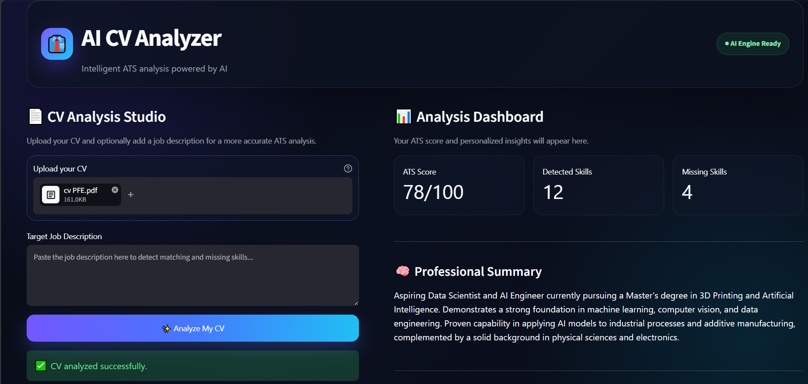

# 👔 AI CV Analyzer

AI CV Analyzer is an intelligent Streamlit application that analyzes PDF resumes using Google Gemini. It generates an AI-based ATS score, detects existing and missing skills, identifies strengths and areas for improvement, and provides personalized recommendations.

Users can also add a target job description to evaluate how well their CV matches a specific role.

> **Note:** The ATS score is AI-generated guidance and does not represent an official score from an employer's Applicant Tracking System.

---

## ✨ Features

- 📄 Upload and analyze CVs in PDF format
- 🔍 Extract resume text using `pdfplumber`
- 📊 Generate an AI-based ATS readiness score
- ✅ Detect technical and professional skills
- ⚠️ Identify missing skills
- 🧠 Generate a professional summary
- 💪 Highlight CV strengths
- 🔎 Identify weaknesses and improvement areas
- 🚀 Provide personalized improvement suggestions
- 🎯 Compare a CV with a target job description
- 🖥️ Premium responsive Streamlit interface
- 🔐 Secure API key management using environment variables

---
## 🖼️ Application Preview

### General CV Analysis

The application can evaluate general ATS readiness without requiring a job description.

<p align="center">
  
   Never commit the real `.env` file or expose the API key publicly.

### 5. Run the application

```powershell
streamlit run app.py
```

Streamlit will display a local address in the terminal and open the application in the browser.

---

## 🎯 Usage

### General ATS Analysis

1. Upload a PDF CV.
2. Leave the Target Job Description field empty.
3. Click **Analyze My CV**.
4. Review the ATS score and personalized insights.

### Job-Specific Analysis

1. Upload a PDF CV.
2. Paste the target job description.
3. Click **Analyze My CV**.
4. Review the compatibility score, matching skills, missing skills, and targeted recommendations.

---

## 📊 Analysis Output

The application generates a structured analysis with:

```json
{
  "ats_score": 0,
  "detected_skills": [],
  "missing_skills": [],
  "strengths": [],
  "weaknesses": [],
  "improvement_suggestions": [],
  "professional_summary": ""
}
```

The ATS score is limited to a value between `0` and `100`.

---

## 🔐 Security and Privacy

- The Gemini API key is stored locally in `.env`.
- `.env` is excluded through `.gitignore`.
- `.env.example` contains only a safe placeholder.
- The Python virtual environment is excluded from Git.
- API keys must never be included in screenshots, commits, or public files.
- Uploaded CV content is sent to the configured Gemini API for analysis.
- Users should avoid uploading documents containing unnecessary sensitive personal information.

---

## ⚠️ Limitations

- The ATS score is an AI-generated estimate.
- Results may vary between analyses.
- The application does not reproduce the scoring logic of a specific employer.
- Image-only or scanned PDFs may not contain extractable text.
- Analysis quality depends on the clarity and structure of the CV.
- Job matching depends on the completeness of the supplied job description.
- AI-generated recommendations should be reviewed before modifying a CV.

---

## 🚀 Future Improvements

- OCR support for scanned CVs
- DOCX resume support
- Downloadable analysis reports
- Multilingual analysis
- Configurable analysis language
- Visual ATS score indicators
- Resume section detection
- Keyword match percentage
- Improved retry handling for temporary API errors
- Optional local LLM support for private offline analysis

---

## 🤝 Contributing

Contributions, suggestions, and improvements are welcome.

1. Fork the repository.
2. Create a feature branch.
3. Commit the changes.
4. Push the branch.
5. Open a pull request.

---

## 📄 License

This project is intended for educational and portfolio purposes.

---

## 👤 Author

**Abdelati Marouf**

AI, Machine Learning, and Software Development enthusiast building practical intelligent applications.

---

## ⭐ Support

If this project is useful, consider giving the repository a star.
